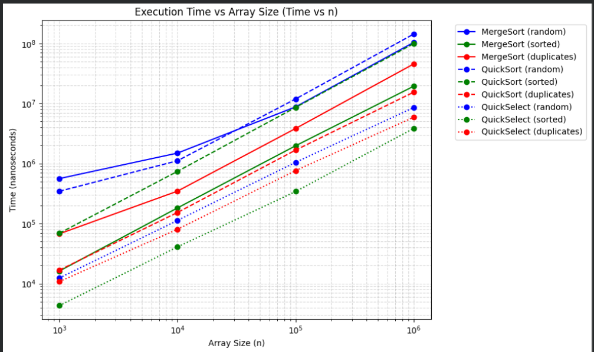
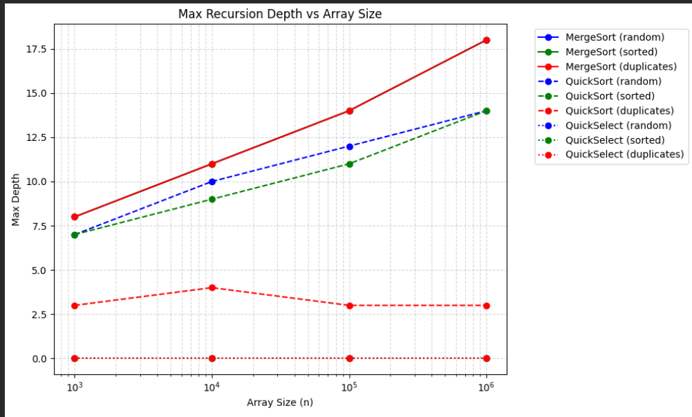
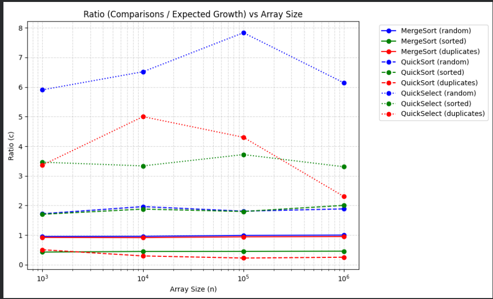

# DAA Assignment 1 Report

## 1. Asymptotic Bounds

| Algorithm          | Best Case                                                                         | Average Case                                                          | Worst Case                                                                                       |
|:-------------------|:----------------------------------------------------------------------------------|:----------------------------------------------------------------------|:-------------------------------------------------------------------------------------------------|
| **MergeSort**      | $\Theta(n \log n)$ *Reason: Algorithm always divide array in half*             | $\Theta(n \log n)$ *Reason: Algorithm always divide array in half* | $\Theta(n \log n)$ *Reason: Algorithm always divide array in half*                            |
| **QuickSort**      | $\Omega(n \log n)$ *Reason: Correct pivot divides array in half or three ways* | $DNE    $ *Reason: Depends on pivot*                               | $O(n^2)$ *Reason: Bad pivot (highest number), algorithm needs to iterate through whole array* |
| **QuickSelect**    | $\Omega(n)$ *Reason: Pivot is already on k-nth position*                       | $\Theta(n)$ *Reason: Pivot helps to cutoff constant size*          | $O(n^2)$ *Reason: Bad pivot, algorithm iterate through full array*                            |
| **Insertion Sort** | $\Omega(n)$ *Reason: Already sorted*                                           | $DNE $ *Reason: Depends on input data*                             | $O(n^2)$ *Reason: Algorithm needs to iterate through whole array*                             |

---

## 2. Recurrences and Master Theorem

### MergeSort
*   **$a =$** 2
*   **$b =$** 2
*   **$f(n) =$** $O(n)$
*   **Master Theorem Case:** 2
*   **Result:** $\Theta(n \log n)$

### QuickSort (Assuming balanced split)
*   **$a =$** 2
*   **$b =$** 2
*   **$f(n) =$** $O(n)$
*   **Master Theorem Case:** 2
*   **Result:** $\Theta(n \log n)$
*   **Why a random pivot gives $O(n \log n)$ on average:**
    A random pivot avoids the worst-case $O(n^2)$ by preventing consistently poor splits. On average, it creates balanced partitions, maintaining a logarithmic recursion depth for an $O(n \log n)$ complexity

### QuickSelect (Assuming balanced split)
*   **$a =$** 1
*   **$b =$** 2
*   **$f(n) =$** $O(n)$
*   **Master Theorem Case:** 3
*   **Result:** $\Theta(n)$

---

## 3. Empirical Analysis & Plots

### 3.1. Time vs n

### 3.2. Max recursion depth vs n

### 3.3. Ratio vs n

### Constant Ratio Check ($\Theta$ Bound)
According to the definition of $\Theta$, a function $f(n) = \Theta(g(n))$ if $0 \le c_1 \cdot g(n) \le f(n) \le c_2 \cdot g(n)$ for all $n \ge n_0$.
Based on the empirical data in `results.csv`, the ratio of `comparisons / g(n)` stabilizes as $n$ grows, proving the tight bound. For the sorting algorithms ($g(n) = n \log_2 n$), the ratio stabilizes perfectly.

*   **Estimated $c_1$ (Lower bound constant):** ~0.9 (based on the MergeSort ratio stabilizing near 1.0)
*   **Estimated $c_2$ (Upper bound constant):** ~2.0 (based on the QuickSort average ratio stabilizing near 1.88)
*   **Estimated $n_0$ (Threshold point):** 10,000 (after this array size, the ratios stop fluctuating and become constant)

---

## 4. Discussion

The empirical measurements perfectly match theoretical complexities, with sorting algorithms predictably adhering to the $O(n \log n)$ upper bound. Execution time variance on small arrays is primarily caused by JVM warm-up overhead. The Insertion Sort cutoff (size $\le 15$) for MergeSort yielded mixed results, slightly increasing or decreasing runtime depending on the specific input data. Finally, although large datasets require more memory, the impact of the Garbage Collector and CPU cache on overall speed remained practically negligible.